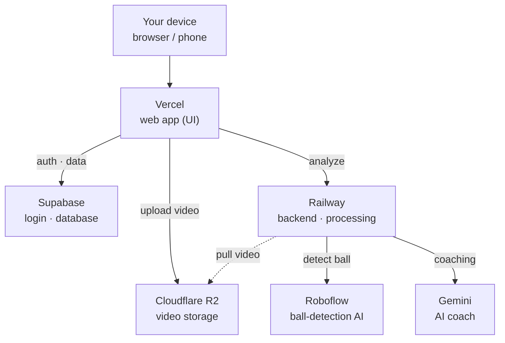

# PickleVision — system architecture

How the connected services fit together, for both the current setup and the
planned go-live setup (which moves video storage to Cloudflare R2).

## What each system does

| System | Role | Powers |
|---|---|---|
| **Vercel** | Hosts the Next.js web app (the UI) | Everything the user sees |
| **Supabase** | Auth + Postgres database (+ video storage *today*) | Login, `matches` / `bookmarks` / `profiles` tables |
| **Cloudflare R2** | Object storage for video files (go-live) | Stores uploaded match videos — **zero egress fees** |
| **Railway** | Python FastAPI backend ("the engine room") | Downloads/decodes video, colour ball-detection, court homography (in/out), trajectory grouping; orchestrates Roboflow + Gemini |
| **Roboflow** | Trained ball-detection model + hosted inference | "Ball Trajectories" map — finds the ball per frame |
| **Gemini** | Google LLM (`gemini-2.5-flash`) | "AI Shot Breakdown" — coaching read from keyframes |

The browser calls Railway **directly** for analysis so long-running jobs don't hit a serverless timeout.

## Go-live architecture (with Cloudflare R2)

## What changes at go-live

Today, **video files live in Supabase Storage**. At go-live they move to **Cloudflare R2**:

- **Why:** Supabase egress is **$0.09/GB** — every analysis download and every re-watch of a (up to 1 GB) video costs money, and it scales linearly with users. **R2 has zero egress fees** ($0.015/GB-month storage only), so analysis pulls and unlimited re-watching are free. This is the difference between ~$0.45/video and ~$0.09/video, and keeps paid-tier margins ~90%.
- **What stays:** Supabase keeps **login + database**. Vercel, Railway, Roboflow and Gemini are unchanged.
- **Migration work (contained):** create an R2 bucket; switch uploads + signed-URL generation from Supabase Storage to R2 (S3 API); point the backend's `download_video` at R2; migrate existing videos.

## Bundled go-live changes (per the billing plan)

These are deferred to be done together when payments are wired up:

1. **Cloudflare R2** storage migration (above).
2. **Stripe** checkout + webhooks (chosen for lowest fees) — wires into the existing `profiles` / `consume_video()` credit model.
3. **Self-host the Roboflow model** on Railway — drops ball-detection cost ~70× (from ~$3.60/video hosted to ~$0.02 in compute).

See `supabase/profiles.sql` for the billing data model.

## Decision log

**2026-06-25 — Stay best-of-breed; don't consolidate onto Cloudflare.**
Keep **Supabase** for auth + Postgres/RLS (Cloudflare has no turnkey consumer auth, and D1 is SQLite with no RLS/`plpgsql` — moving would be a downgrade + rewrite for no cost benefit, since auth/DB aren't egress-heavy). Use **Cloudflare** only for **R2 video storage** (the egress win) and, optionally, **DNS/CDN at the edge**. **Cloudflare work is deferred** — not started yet; it lands with the go-live batch (R2 + Stripe + self-hosted model).
